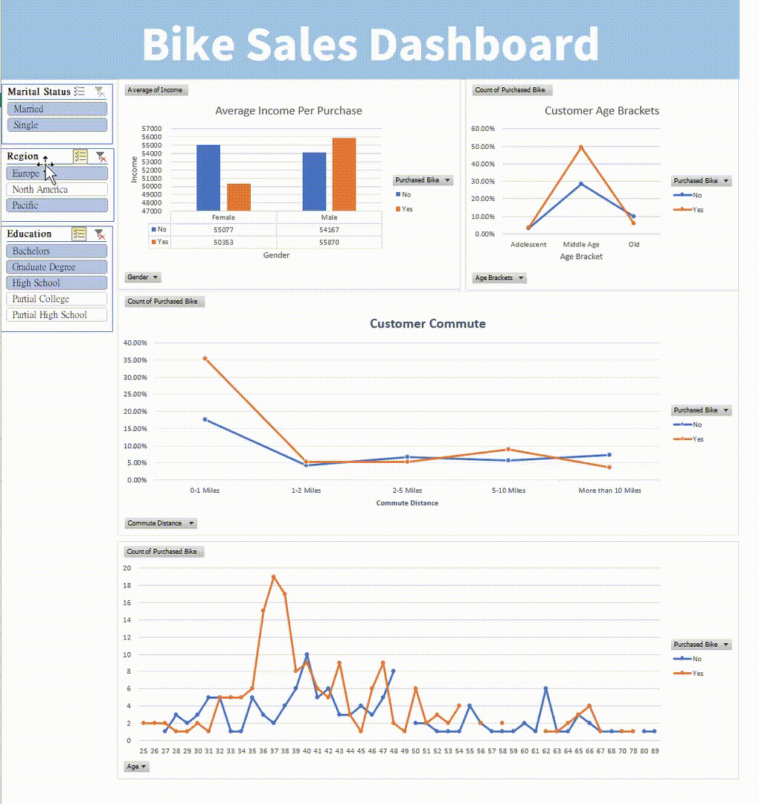
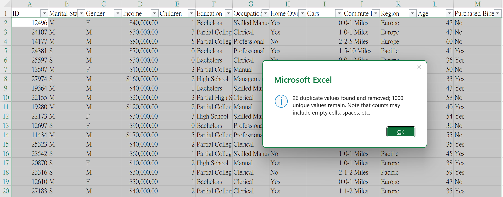
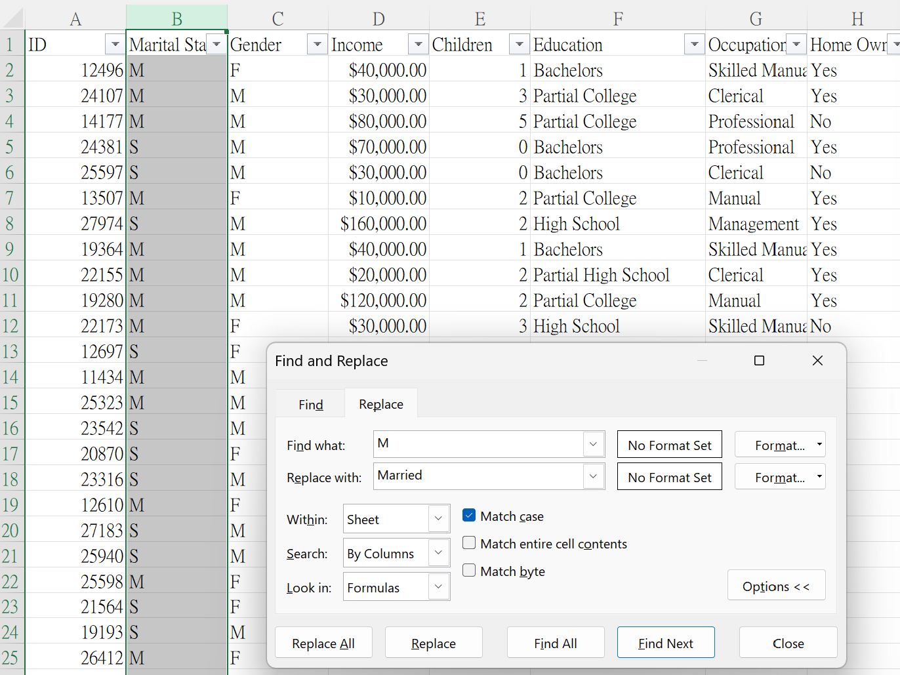
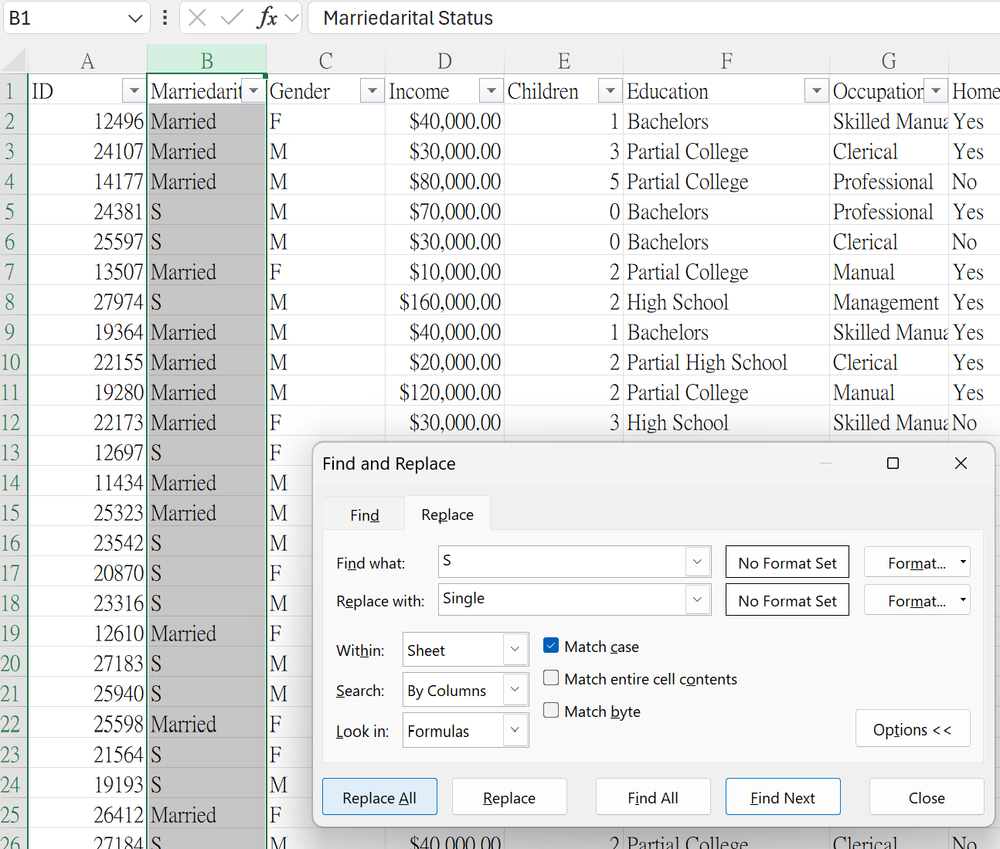
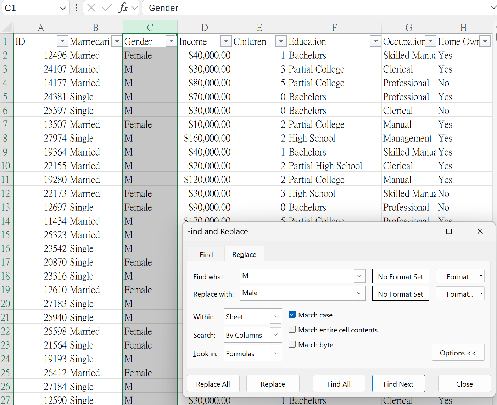
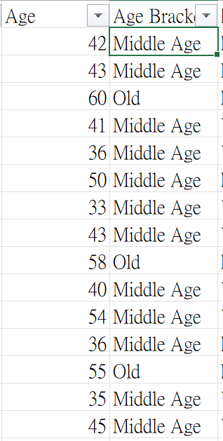
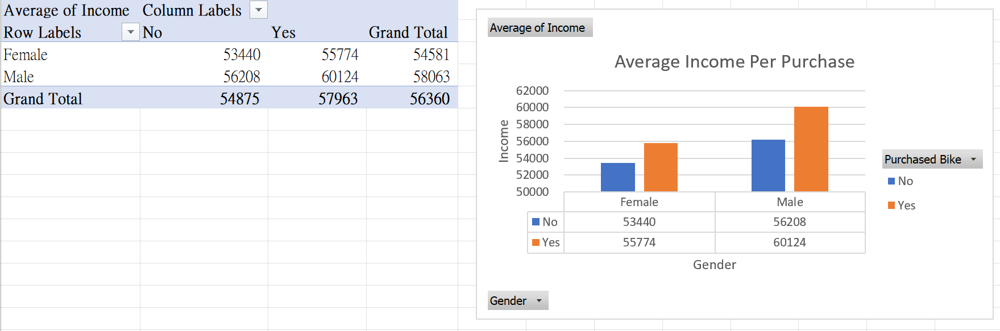
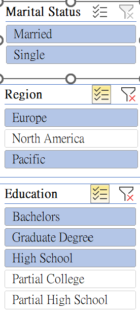

# 🚴 Bike Sales Dashboard — Excel Data Analysis Project

## 📌 Project Overview

This project uses **Microsoft Excel** to clean, analyse, and visualise customer data from a bike sales dataset.

The objective was to explore **customer demographics and purchasing behaviour** and present the findings through an interactive Excel dashboard.

### Dashboard

<p align="center">
  
</p>


The project demonstrates practical skills in:

* Data cleaning and transformation
* Excel formulas
* Pivot tables
* Data analysis
* Data visualisation
* Dashboard development
* Interactive slicers

> **Note:** This project was completed as a learning project based on a tutorial by **Alex The Analyst**, with additional analysis and presentation of the results.

---

## 🎯 Project Objective

The analysis aims to answer questions such as:

* Does income differ between customers who purchase a bike and those who do not?
* Which commute distances are most common among bike buyers?
* Which age groups are more represented among bike purchasers?
* Are there noticeable patterns between customer demographics and bike purchases?

---

## 🗂️ Dataset

**Source:** [Bike Sales in Europe — Kaggle](https://www.kaggle.com/datasets/sadiqshah/bike-sales-in-europe/data)

The dataset contains information about **bike buyers and their demographic characteristics**, including:

| Variable         | Description                               |
| ---------------- | ----------------------------------------- |
| Marital Status   | Whether the customer is married or single |
| Gender           | Customer gender                           |
| Income           | Customer income                           |
| Children         | Number of children                        |
| Education        | Education level                           |
| Occupation       | Customer occupation                       |
| Home Owner       | Whether the customer owns a home          |
| Cars             | Number of cars owned                      |
| Commute Distance | Distance travelled for commuting          |
| Region           | Customer region                           |
| Age              | Customer age                              |
| Purchased Bike   | Whether the customer purchased a bike     |

The project was inspired by **Alex The Analyst's Excel tutorial**:

[Alex The Analyst — Excel Tutorial](https://www.youtube.com/watch?v=opJgMj1IUrc&list=PLUaB-1hjhk8FE_XZ87vPPSfHqb6OcM0cF&index=27)

---

## 📁 Workbook Structure

The original workbook contained a single worksheet containing the raw dataset.

I extended the workbook into four worksheets to separate the data preparation and analysis stages:

1. **Raw Data** — Original dataset
2. **Working Sheet** — Cleaned and transformed data
3. **Pivot Tables** — Aggregated data used for analysis and charts
4. **Dashboard** — Interactive visualisation of the key findings

This structure keeps the raw data separate from the transformed data and makes the analysis easier to follow and maintain.

---

# 🧹 Part 1 — Data Cleaning

## 1. Remove Duplicate Records

Duplicate records were identified and removed from the dataset to improve data quality and ensure that individual records were not counted multiple times during analysis.

<p align="center">
  
</p>

---

## 2. Standardise Marital Status

The original `Marital Status` column used abbreviated values:

* `S` → `Single`
* `M` → `Married`

This was changed to make the dataset easier to interpret and present.

<p align="center">
  
  
</p>

---

## 3. Standardise Gender

The original `Gender` column contained abbreviated values:

* `F` → `Female`
* `M` → `Male`

These values were standardised to improve readability.

<p align="center">
  
</p>
---

## 4. Create Age Brackets

An `Age Bracket` column was created to group customers into broader age categories for analysis.

The following Excel formula was used:

```excel
=IF(L2>54,"Old",IF(L2>=31,"Middle Age",IF(L2<31,"Adolescent","Invalid")))
```

The resulting groups were:

|   Age | Age Bracket |
| ----: | ----------- |
|  < 31 | Adolescent  |
| 31–54 | Middle Age  |
|  > 54 | Old         |

Grouping customers into age brackets makes it easier to identify patterns that may not be obvious when analysing individual ages.

<p align="center">
  
</p>

---

# 📊 Part 2 — Data Analysis & Visualisation

## 1. Create Pivot Tables

Pivot tables were created to aggregate the cleaned dataset and investigate relationships between customer characteristics and bike purchases.

The main analyses included:

* Average income by gender and bike purchase status
* Bike purchases by commute distance
* Bike purchases by age bracket
* Bike purchases by individual age



---

# 📈 Part 3 — Interactive Dashboard

The pivot tables were converted into charts and arranged into a single dashboard.

The dashboard allows users to explore the data interactively using **Excel slicers**.

### Adding Slicers

1. Select one of the PivotCharts.
2. Go to **PivotChart Analyze → Insert Slicer**.
3. Select the fields to use as filters.
4. Select the slicer.
5. Go to **Slicer → Report Connections**.
6. Connect the slicer to the relevant pivot tables.

This allows the dashboard charts to update simultaneously when a filter is selected.

<p align="center">
  
</p>

---

# 🔍 Key Insights

### 1. Average Income and Bike Purchase

The relationship between income and bike purchase differs by gender.

For male customers, average income was relatively similar between those who purchased a bike and those who did not.

For female customers, the average income was higher among those who did not purchase a bike:

* **Female — Purchased:** approximately **$50,353**
* **Female — Did not purchase:** approximately **$55,077**

This suggests that income alone does not consistently correspond with bike purchase behaviour across genders.

---

### 2. Commute Distance

Customers with a **0–1 mile commute** represent a large proportion of the dataset.

Within this group, approximately **two-thirds purchased a bike**, while approximately one-third did not.

This makes short-distance commuters an interesting customer segment for further analysis.

> This analysis shows an association in the dataset; it does not establish that commute distance causes customers to purchase bikes.

---

### 3. Age Brackets

The **Middle Age (31–54)** group accounts for **149 of the 177 bike purchasers** in the analysed age-bracket data.

This makes the middle-aged customer segment the largest group among bike purchasers in this dataset.

---

### 4. Individual Customer Age

Among customers who purchased a bike, the three most common ages were:

| Rank | Age |
| ---: | --: |
|    1 |  37 |
|    2 |  38 |
|    3 |  36 |

The concentration around these ages provides a more detailed view of the age distribution than the broader age brackets.

---

# 🛠️ Tools & Skills

### Tools

* **Microsoft Excel**
* Pivot Tables
* PivotCharts
* Excel formulas
* Slicers
* Dashboard design

### Data Analysis Skills

* Data cleaning
* Data transformation
* Data aggregation
* Exploratory data analysis
* Demographic analysis
* Pattern identification
* Data visualisation
* Dashboard development

---

# 💡 What I Learned

Through this project, I developed practical experience in taking a raw dataset through a basic analytics workflow:

**Raw Data → Data Cleaning → Data Transformation → Pivot Tables → Visualisation → Dashboard → Insights**

The project also helped me understand how to turn individual data fields into meaningful analytical categories, such as creating age brackets, and how to use interactive dashboards to explore patterns across different customer segments.

---

# 🚀 Future Improvements

If I continued developing this project, I would:

* Add additional KPIs to the dashboard, such as total customers and bike purchase rate.
* Calculate **bike purchase percentage** rather than relying only on purchase counts.
* Compare purchase rates across regions, occupations, education levels and home ownership.
* Investigate whether income, age and commute distance interact with one another.
* Improve dashboard layout and visual hierarchy.
* Add more interactive filters.
* Explore the dataset using **SQL or Python** to reproduce and extend the analysis.

---

## 📂 Project Files

```text
📦 Bike-Sales-Excel-Project
 ├── 📊 Bike Sales Dashboard.xls
 ├── remove-duplicates.png
 ├── marital-status.png
 ├── gender.png
 ├── age-bracket.png
 ├── pivot-tables.png
 ├── slicers.png
 ├── dashboard.png
 └── 📄 README.md
```

---

## 📚 References

* Dataset: [Bike Sales in Europe — Kaggle](https://www.kaggle.com/datasets/sadiqshah/bike-sales-in-europe/data)
* Tutorial: [Alex The Analyst — YouTube](https://www.youtube.com/watch?v=opJgMj1IUrc&list=PLUaB-1hjhk8FE_XZ87vPPSfHqb6OcM0cF&index=27)

---

## 👤 Author
**Queenie Chong**

**GitHub: Meowcky**
